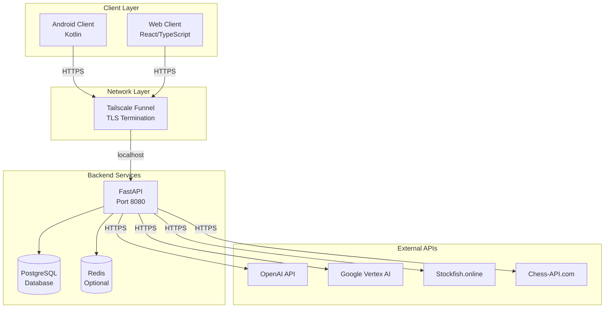
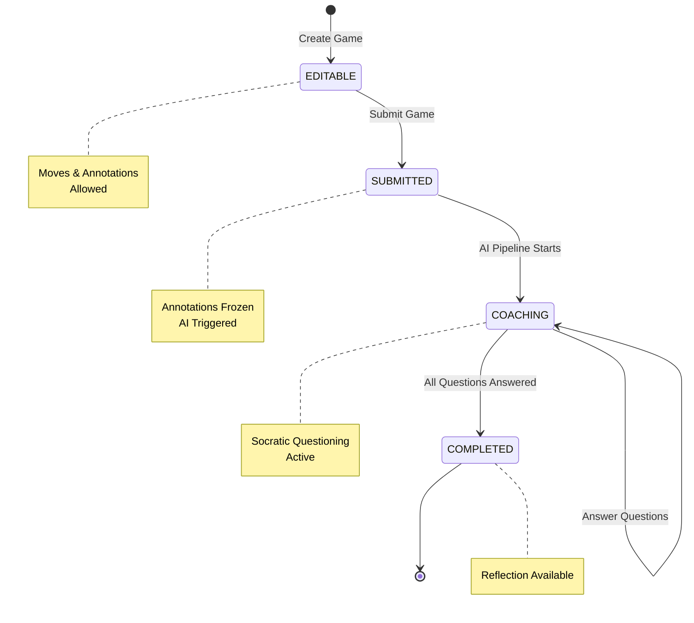
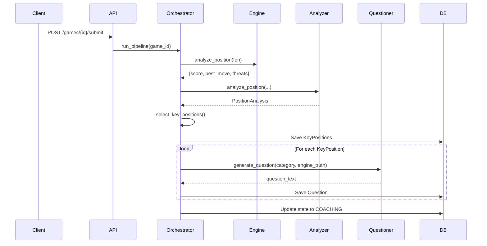
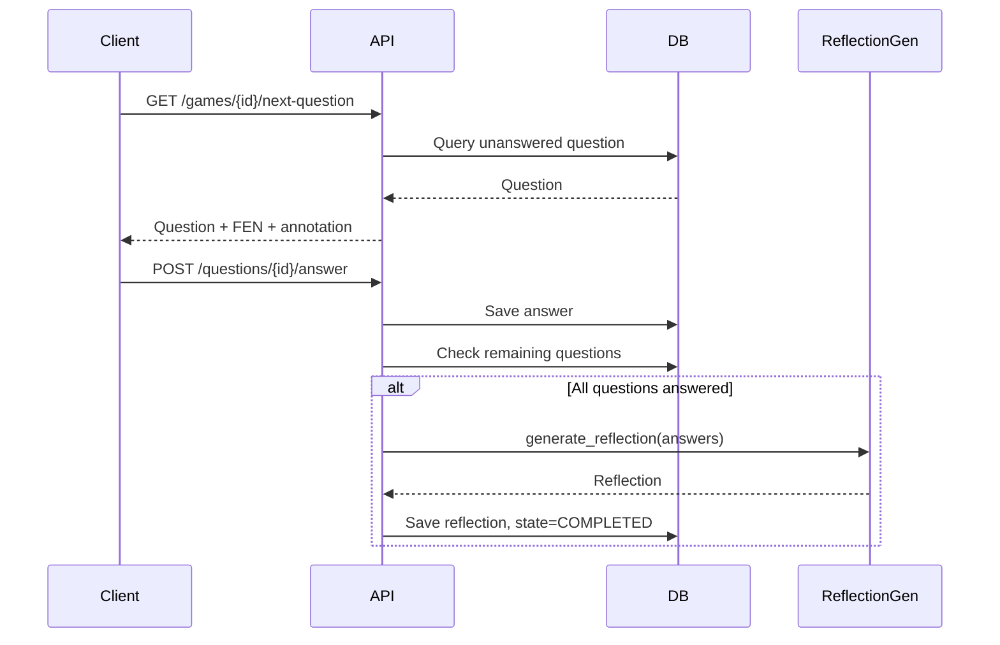

# Chess-in-One AI Coach - Comprehensive Architecture & Design Document

**Status**: IN PROGRESS  
**Last Updated**: January 3, 2026  
**Purpose**: Complete end-to-end architectural and design reference

---

## Table of Contents

1. [Executive Summary & System Overview](#1-executive-summary--system-overview)
2. [System Architecture (High-Level)](#2-system-architecture-high-level)
3. [Detailed Component Design](#3-detailed-component-design)
4. [Data Flow & State Management](#4-data-flow--state-management)
5. [Security Architecture](#5-security-architecture)
6. [AI Integration Architecture](#6-ai-integration-architecture)
7. [API Design](#7-api-design)
8. [Deployment Architecture](#8-deployment-architecture)
9. [Error Handling & Recovery](#9-error-handling--recovery)
10. [Performance & Scalability](#10-performance--scalability)
11. [Compliance & Governance](#11-compliance--governance)
12. [Implementation Details](#12-implementation-details)
13. [Diagrams & Visualizations](#13-diagrams--visualizations)
14. [Appendices](#14-appendices)

---

## 1. Executive Summary & System Overview

### 1.1 Product Intent

Chess-in-One AI Coach is a **post-game chess coaching application** designed to improve **thinking habits** rather than move accuracy. The system uses a Socratic questioning approach to guide junior competitive chess players through reflective analysis of their games.

**Core Objective**: The system captures the player's thinking first, identifies missing thinking dimensions, and uses structured Socratic questioning to provide minimal, calm, reflective guidance.

**Non-Goals**:
- No real-time coaching during games
- No move evaluation or scoring
- No chat-style interaction
- No public cloud or multi-tenant service

### 1.2 System Scope

**Supported Mode**: Strictly post-game analysis

**Explicit Exclusions**:
- Live boards
- Clock-aware behavior
- In-game move suggestions
- Real-time coaching
- Chat-style interaction
- Engine-first analysis

### 1.3 Target Users

- **Primary**: Junior competitive chess players (fast, intuitive decision-makers, tactically strong)
- **Secondary**: Parents (governance and approval)

### 1.4 Non-Negotiable Constraints

1. **No Calculation**: Frontend NEVER calculates chess moves - relies 100% on backend EngineTruth
2. **Backend Authority**: Backend is Single Source of Truth
3. **No Chat**: Structured Socratic state machine, NOT a chatbot
4. **Parent Approval**: Required for non-default AI tiers
5. **AI Hallucination Prevention**: All AI prompts include EngineTruth; AI output validated against engine facts

---

## 2. System Architecture (High-Level)

### 2.1 Architectural Patterns

#### Hybrid Intelligence Architecture
The system follows a strict Hybrid Intelligence model:
- **Chess engines** (Stockfish/Chess API providers) are the sole source of chess truth
- **AI Coach** is a pedagogical interpreter, not a chess reasoner
- AI MUST trust engine-provided facts as authoritative
- AI MUST NOT independently evaluate positions
- AI MUST NOT search for best moves or tactics

#### Zero-Trust Client Model
- Clients (Web, Android) are untrusted
- All validation and business logic in backend
- Frontend is stateless/dumb
- Backend enforces all state transitions

#### State Machine Pattern
- Strict one-way state transitions: `EDITABLE → SUBMITTED → COACHING → COMPLETED`
- State transitions are irreversible
- Backend is the only authority for state changes

#### Event-Driven Pipeline Architecture
- AI pipeline runs asynchronously after game submission
- Background tasks handle long-running operations
- Redis locks prevent concurrent pipeline execution

### 2.2 System Topology

```
┌─────────────────┐         ┌─────────────────┐
│  Android Client │         │   Web Client    │
│   (Kotlin)      │         │ (React/TS)      │
└────────┬────────┘         └────────┬────────┘
         │                           │
         │  HTTPS                    │  HTTPS
         │                           │
         └───────────┬───────────────┘
                     │
                     ▼
         ┌───────────────────────┐
         │  Tailscale Funnel     │
         │  (TLS Termination)    │
         └───────────┬───────────┘
                     │
                     ▼
         ┌───────────────────────┐
         │  Mac Mini             │
         │  (Private IP)         │
         └───────────┬───────────┘
                     │
                     ▼
         ┌───────────────────────┐
         │  Docker Compose       │
         │  - FastAPI (8080)     │
         │  - PostgreSQL         │
         │  - Redis (optional)   │
         └───────────┬───────────┘
                     │
                     ▼
         ┌───────────────────────┐
         │  External APIs        │
         │  - OpenAI/Gemini      │
         │  - Stockfish Online   │
         │  - Chess-API.com      │
         └───────────────────────┘
```

**Trust Boundaries**:
- Clients are zero-trust (outside trust boundary)
- Backend services are trusted (inside trust boundary)
- External APIs are untrusted (outbound calls only)

### 2.3 Component Architecture

#### Backend Services
- **FastAPI Application** (`backend/api/main.py`): Main API server
- **PostgreSQL**: Primary database (SQLite in development)
- **Redis**: Optional distributed locking and caching
- **AI Providers**: OpenAI, Google Vertex AI (Gemini)
- **Chess Engine Providers**: Stockfish.online, Chess-API.com

#### Frontend Clients
- **Web Client** (`web/`): React + TypeScript, Tailwind CSS
- **Android Client** (`android/`): Kotlin (structure exists)

#### Parent Control Interface
- **Web-only** interface for parent governance
- AI tier management
- Approval workflows
- Usage visibility

---

## 3. Detailed Component Design

### 3.1 Backend Core Components

#### API Layer

**Main Application** (`backend/api/main.py`):
- FastAPI app initialization
- Middleware stack:
  - CORS middleware (before auth)
  - Authentication middleware (`AuthMiddleware`)
  - Request logging middleware
- Exception handlers for `ChessCoachError`
- Static file serving for PCI UI
- Health check endpoint

**Router Organization**:
- `/games` - Game management endpoints
- `/questions` - Question answering endpoints
- `/pci` - Parent Control Interface endpoints

#### Game Lifecycle Management

**Game Service** (`backend/api/games/game_service.py`):
- `create_game()`: Creates new game in EDITABLE state
- `get_game()`: Retrieves game with annotations
- `get_games()`: Lists all games
- `delete_game()`: Deletes game
- `_extract_annotations_from_pgn()`: Extracts annotations from PGN

**Submission Service** (`backend/api/games/submission_service.py`):
- `submit_game()`: Transitions game from EDITABLE to SUBMITTED
- `_requires_approval()`: Checks if parent approval needed
- `_get_valid_approval()`: Retrieves valid approval record
- Enforces state machine rules
- Freezes annotations on submission

**Annotation Service** (`backend/api/games/annotation_service.py`):
- `add_or_update_annotation()`: Adds/updates annotations
- Enforces EDITABLE state requirement
- Handles annotation freezing

#### AI Orchestration Pipeline

**AI Orchestrator** (`backend/api/ai/orchestrator.py`):
- `run_pipeline()`: Main pipeline entry point with Redis locking
- `_execute_pipeline()`: Core pipeline logic
- `_run_analyzer()`: Position analysis and key position selection
- `_generate_socratic_questions()`: Question generation per key position
- Handles graceful degradation if Redis unavailable

**Pipeline Stages**:
1. Chess Situation Analyzer (internal)
2. Persist 3-5 key positions
3. Socratic Question Loop (per position)
4. Reflection Generation (after all questions answered)

#### Position Analysis

**Position Analyzer** (`backend/api/ai/position_analyzer.py`):
- `analyze_position()`: Comprehensive position analysis
- `_calculate_material_balance()`: Material evaluation
- `_detect_tactical_patterns()`: Fork, pin, skewer detection
- `_assess_king_safety()`: King safety scoring
- `_assess_piece_activity()`: Piece activity scoring
- `_analyze_move_quality()`: Move quality vs best move
- `_calculate_criticality_score()`: Multi-factor criticality (0-100)
- `_determine_reason_code()`: OPP_INTENT, THREAT_AWARENESS, TRANSITION
- `select_key_positions()`: Selects 3-5 most critical positions

**PositionAnalysis Dataclass**:
- Stores comprehensive position data
- Includes engine analysis, positional features, criticality metrics
- Game phase detection (opening/middlegame/endgame)

#### Question Selection

**Intelligent Question Selector** (`backend/api/ai/question_selector.py`):
- `select_questions()`: Dynamically selects relevant questions
- Analyzes position characteristics
- Prioritizes questions based on:
  - Threats detected
  - Tactical patterns
  - Evaluation imbalances
  - Move quality
  - Game phase
- Returns 3-5 questions per position (not always 6)
- Always includes REFLECTION at the end

**Question Categories**:
- `OPP_INTENT`: Opponent's intentions
- `THREAT`: Threat awareness
- `CHANGE`: Position changes
- `WORST_PIECE`: Piece activity
- `ALTERNATIVES`: Alternative moves
- `REFLECTION`: Thinking reflection

#### AI Providers

**Chess Engine Provider** (`backend/api/ai/providers/engine.py`):
- `analyze_position()`: Fetches engine analysis
- Priority: Stockfish.online → Chess-API.com v2 → Chess-API.com v1
- Retry logic with exponential backoff
- Fallback values if all APIs fail
- Returns: `{score, best_move, threats, depth}`

**Socratic Questioner Provider** (`backend/api/ai/providers/socratic_questioner.py`):
- `generate_question()`: Generates Socratic question
- Supports OpenAI and Google Vertex AI
- Template fallback if no AI configured
- `_build_question_prompt()`: Constructs prompt with EngineTruth
- Enforces contract: neutral, non-evaluative, age-appropriate

**Reflection Generator Provider** (`backend/api/ai/providers/reflection_generator.py`):
- `generate_reflection()`: Generates final reflection
- Input: answers by category, player color, question counts
- Output: `{thinking_patterns, missing_elements, habits}` (1-2 habits only)
- Template fallback if no AI configured
- Validates output format

#### Validators

**Orchestrator Validator** (`backend/api/ai/validators/orchestrator_validator.py`):
- `validate_analyzer_output()`: Validates analyzer output
- Checks: key_positions count (1-5), required fields, EngineTruth presence
- Throws on first violation (no auto-repair)

#### Authentication & Authorization

**Auth Middleware** (`backend/api/auth/middleware.py`):
- JWT token validation
- Device binding enforcement
- Role-based access control (CHILD vs PARENT)
- Public routes: `/health`, `/`, `/docs`, `/pci-gui`, `/pci-ui`, `/dev/token`
- PCI routes require PARENT role
- Game/question routes require CHILD role

**JWT Claims**:
```json
{
  "sub": "user_id",
  "role": "CHILD | PARENT",
  "device_id": "uuid",
  "exp": 123456
}
```

#### Parent Control Interface

**PCI Router** (`backend/api/pci/router.py`):
- `/pci/settings`: Get/update AI provider settings
- `/pci/approvals`: Create approval requests
- `/pci/approvals/{id}/decision`: Approve/deny requests
- `/pci/usage`: View AI usage history
- `/pci/available-models`: List available AI models
- `/pci/debug-settings`: Debug endpoint for settings

**Settings Management**:
- Reads from `.env` file
- Writes updates to `.env` file
- Masks sensitive values for display
- Supports OpenAI and Google Vertex AI configuration

### 3.2 Database Design

**Schema** (`backend/api/common/models.py`):

**Game Model**:
```python
- id: Integer (PK)
- user_id: String (indexed)
- state: Enum(EDITABLE, SUBMITTED, COACHING, COMPLETED)
- player_color: String
- opponent_name: String
- event: String
- date: DateTime
- time_control: String
- pgn: String
- created_at: DateTime
- updated_at: DateTime
- reflection: JSON (AI-generated)
```

**Annotation Model**:
```python
- id: Integer (PK)
- game_id: Integer (FK → Game.id)
- move_number: Integer
- content: String
- frozen: Boolean (default=False)
```

**KeyPosition Model**:
```python
- id: Integer (PK)
- game_id: Integer (FK → Game.id)
- fen: String
- reason_code: String
- engine_truth: JSON (evaluation, best_move, threats, position_analysis)
- order: Integer
```

**Question Model**:
```python
- id: Integer (PK)
- key_position_id: Integer (FK → KeyPosition.id)
- category: String (OPP_INTENT, THREAT, CHANGE, etc.)
- question_text: String
- answer_text: String (nullable)
- skipped: Boolean (default=False)
- order: Integer
```

**ParentApproval Model**:
```python
- id: Integer (PK)
- game_id: Integer (FK → Game.id)
- tier: String (STANDARD, ADVANCED)
- approved: Boolean (default=False)
- expires_at: DateTime
- used: Boolean (default=False)
- created_at: DateTime
```

**SystemSetting Model**:
```python
- id: Integer (PK)
- key: String (unique, indexed)
- value: String
- updated_at: DateTime
```

**State Enforcement Rules**:
- `Annotation.frozen = true` iff `Game.state != EDITABLE`
- `Answer` inserts forbidden unless `Game.state == COACHING`
- All state transitions server-validated only

**Persistence Layer**:
- SQLAlchemy async patterns
- AsyncSession for all database operations
- Transaction management with `async with db.begin()`
- Eager loading with `selectinload()` for relationships

### 3.3 Frontend Architecture

**Web Client Structure** (`web/src/`):

**Views**:
- `App.tsx`: Main application router
- `GameList.tsx`: List of games
- `CreateGame.tsx`: Game creation
- `GameEntry.tsx`: Game editing and annotation
- `AIProcessing.tsx`: Processing/waiting page
- `GuidedQuestioning.tsx`: Question answering interface
- `FinalReflection.tsx`: Reflection display
- `ParentControlInterface.tsx`: Parent control dashboard

**Components**:
- `ChessBoard.tsx`: Chess board display
- `MoveNavigator.tsx`: Move navigation controls
- `MoveTree.tsx`: Move tree visualization
- `AnnotationPanel.tsx`: Annotation input
- `GameSubmission.tsx`: Game submission UI

**Services**:
- `api.ts`: HTTP client with error handling
- `games.ts`: Game API service methods

**State Management**:
- React hooks for local state
- API service layer for backend communication
- No global state management (stateless frontend)

---

## 4. Data Flow & State Management

### 4.1 Game Lifecycle State Machine

**States**:
- `EDITABLE`: Moves & annotations allowed
- `SUBMITTED`: Point of no return, annotations frozen, AI triggered
- `COACHING`: Socratic questioning loop active
- `COMPLETED`: Final reflection available

**State Transitions**:
```
EDITABLE → SUBMITTED → COACHING → COMPLETED
```

**Transition Rules**:
- Only backend may change state
- Transitions are single-direction and irreversible
- Invalid transitions return HTTP 409
- Submit endpoint is idempotent

**Enforcement**:
- State checks in all mutation endpoints
- Database constraints (where applicable)
- Service layer validation

### 4.2 AI Pipeline Data Flow

**Input Data**:
- PGN string (complete game)
- Annotations (player's thinking)
- Player color
- Game metadata

**Pipeline Flow**:
1. **Position Collection**: Parse PGN, collect positions after move 10
2. **Engine Analysis**: Analyze each position with chess engine
3. **Position Analysis**: Calculate criticality scores
4. **Key Position Selection**: Select 3-5 most critical positions
5. **Question Generation**: Generate questions per key position
6. **Question Persistence**: Store questions in database
7. **State Transition**: Game state → COACHING

**EngineTruth Generation**:
- Fetched from Stockfish.online or Chess-API.com
- Includes: evaluation score, best move, threats, depth
- Stored in `KeyPosition.engine_truth` JSON field
- Passed to AI providers for question generation

**Question Flow**:
- Questions generated per key position
- Dynamically selected based on position characteristics
- Ordered by priority/relevance
- Stored with category and order

**Answer Collection**:
- Answers submitted via `/questions/{id}/answer`
- Stored in `Question.answer_text`
- Skip option available
- Duplicate answers rejected

**Reflection Generation**:
- Triggered when all questions answered
- Input: answers by category
- Generated by AI provider
- Stored in `Game.reflection` JSON field
- Game state → COMPLETED

### 4.3 Question Flow State Machine

**Per-Position Flow**:
- Questions presented one at a time
- Order determined by intelligent selector
- Skip advances to next question
- Resume continues from last unanswered question

**Question Sequence**:
- Not fixed order (dynamic selection)
- 3-5 questions per position
- REFLECTION always at end
- Adapts to game phase

**Answer Handling**:
- One answer per question
- Skip recorded as `skipped = true`
- Duplicate answers rejected (HTTP 409)
- All answers required before reflection

---

## 5. Security Architecture

### 5.1 Authentication & Authorization

**JWT Token Structure**:
- Claims: `sub`, `role`, `device_id`, `exp`
- Algorithm: HS256 (configurable)
- Secret: Loaded from environment

**Device Binding**:
- `device_id` claim required
- Prevents token reuse on different devices
- Enforced in middleware

**Role-Based Access Control**:
- `CHILD` role: Game/question endpoints
- `PARENT` role: PCI endpoints only
- Role checked in middleware before route handler

**Token Validation**:
- Signature verification
- Expiration check
- Required claims validation
- Invalid tokens return HTTP 401

### 5.2 Network Security

**Tailscale Funnel**:
- TLS termination at edge
- No direct public IP exposure
- Private network isolation
- Clients never join tailnet

**Backend Binding**:
- Services bind to `127.0.0.1` only
- No public ports exposed
- Access only through Tailscale

**Outbound Connections**:
- HTTPS only for external APIs
- No inbound connections accepted
- Firewall rules enforce isolation

### 5.3 Data Security

**AI Credential Management**:
- Stored in `.env` file (not in database)
- Never logged or exposed to clients
- Masked in PCI UI display
- Encrypted at rest (file system permissions)

**PII Handling**:
- No personal data sent to AI providers
- Only chess positions and annotations
- No user identification in AI prompts

**Audit Logging**:
- State transitions logged
- AI invocation metadata logged (no content)
- Approval grants/denials logged
- Never logged: AI prompts, AI responses, child answers

### 5.4 Threat Model

**STRIDE Analysis**:

**Spoofing**:
- Mitigation: JWT + device binding, parent approval required

**Tampering**:
- Mitigation: Immutable state machine, server-side enforcement

**Repudiation**:
- Mitigation: Backend-logged approval events, usage counters

**Information Disclosure**:
- Mitigation: AI keys encrypted, no PII in AI prompts

**Denial of Service**:
- Mitigation: Per-game invocation caps, explicit parent approval gates

**Elevation of Privilege**:
- Mitigation: Separate auth roles, web-only PCI, no parent features in child UI

---

## 6. AI Integration Architecture

### 6.1 Hybrid Intelligence Model

**EngineTruth Contract**:
- Mandatory for all AI invocations
- Includes: evaluation score, best move, threats
- AI MUST trust engine facts as authoritative
- AI MUST NOT independently evaluate positions

**AI Role Separation**:
- **Chess Situation Analyzer**: Internal only, JSON output
- **Socratic Questioner**: Child-facing, questions only
- **Reflection Generator**: Final output, 1-2 habits only

**Hallucination Prevention**:
- All AI prompts include EngineTruth
- AI outputs validated against engine facts
- Validators reject contradictions
- No auto-repair or retries

### 6.2 AI Provider Abstraction

**Provider Registry**:
- Backend-only mapping: Tier → Provider → Model → Secret
- Clients never see provider names
- Abstracted as "STANDARD", "ADVANCED" tiers

**Secret Management**:
- Stored in `.env` file
- Loaded on backend startup
- Never exposed to clients
- Masked in PCI UI

**Fallback Mechanisms**:
- OpenAI → Google Vertex AI → Template
- Template questions/reflections if no AI configured
- Graceful degradation

### 6.3 AI Contracts

**Analyzer Contract**:
- Input: PGN + annotations
- Output: JSON with 3-5 key positions
- No natural language
- No evaluation

**Socratic Questioner Contract**:
- Input: FEN + EngineTruth + category
- Output: Single question string
- Neutral, non-evaluative
- Age-appropriate

**Reflection Generator Contract**:
- Input: Answers by category
- Output: `{thinking_patterns, missing_elements, habits}`
- 1-2 habits only
- Non-evaluative language

**Validator Contracts**:
- Output validation before persistence
- Throws on first violation
- No auto-repair

---

## 7. API Design

### 7.1 REST API Structure

**Base URL**: `http://localhost:8080` (or Tailscale Funnel URL)

**Authentication**: Bearer token in `Authorization` header

**Response Format**: JSON

**Error Handling**:
- HTTP status codes
- Error details in response body
- Consistent error format

### 7.2 Child-Facing APIs

**Game Management**:
- `POST /games` - Create game
- `GET /games` - List games
- `GET /games/{id}` - Get game
- `DELETE /games/{id}` - Delete game
- `POST /games/{id}/submit` - Submit game for AI processing
- `POST /games/{id}/annotations` - Add/update annotation

**Question Endpoints**:
- `GET /games/{id}/next-question` - Get next unanswered question
- `POST /questions/{id}/answer` - Answer question

**Reflection Endpoints**:
- `GET /games/{id}/reflection` - Get final reflection

### 7.3 Parent Control Interface APIs

**Settings**:
- `GET /pci/settings` - Get AI provider settings
- `POST /pci/settings` - Update AI provider settings
- `GET /pci/available-models` - List available models
- `GET /pci/debug-settings` - Debug settings

**Approvals**:
- `POST /pci/approvals` - Create approval request
- `POST /pci/approvals/{id}/decision` - Approve/deny request

**Usage**:
- `GET /pci/usage` - View AI usage history

---

## 8. Deployment Architecture

### 8.1 Infrastructure

**Host**: Mac Mini (dedicated hardware)

**Container Runtime**: Docker Desktop

**Services**:
- FastAPI (Python) - Port 8080 (localhost only)
- PostgreSQL 16 - Internal only
- Redis 7 - Internal only (optional)

**Docker Compose** (`backend/docker-compose.yml`):
- Service definitions
- Volume mounts
- Environment variables
- Network configuration

### 8.2 Network Configuration

**Tailscale Setup**:
- Funnel enabled for public access
- TLS termination at Tailscale edge
- Backend services on private IP
- No public ports exposed

**Port Binding**:
- API: `127.0.0.1:8080`
- Database: Internal only
- Redis: Internal only

### 8.3 Environment Configuration

**Environment Variables** (`.env` file):
- `DATABASE_URL`: Database connection string
- `REDIS_URL`: Redis connection string
- `JWT_SECRET`: JWT signing secret
- `JWT_ALGORITHM`: JWT algorithm (HS256)
- `OPENAI_API_KEY`: OpenAI API key
- `OPENAI_MODEL_NAME`: OpenAI model name
- `GOOGLE_CLOUD_PROJECT`: Google Cloud project ID
- `GOOGLE_CLOUD_LOCATION`: Google Cloud location
- `GOOGLE_APPLICATION_CREDENTIALS_JSON`: Google service account JSON
- `AI_MODEL_NAME`: AI model name

**Configuration Loading**:
- Pydantic Settings with `.env` file support
- Loaded on backend startup
- Environment variables override file values

---

## 9. Error Handling & Recovery

### 9.1 Error Categories

**Validation Errors**:
- Invalid state transitions (HTTP 409)
- Missing required fields (HTTP 400)
- Invalid data format (HTTP 422)

**State Transition Errors**:
- Invalid transition from current state (HTTP 409)
- Game not found (HTTP 404)
- Already in target state (HTTP 409)

**AI Provider Errors**:
- API failures (logged, fallback to template)
- Timeout errors (logged, fallback)
- Invalid output (validator throws)

**Network Errors**:
- Redis connection failures (graceful degradation)
- External API timeouts (retry with backoff)
- Database connection errors (HTTP 500)

### 9.2 Recovery Mechanisms

**Partial Progress Preservation**:
- Completed answers persist
- Key positions saved even if pipeline fails
- Questions generated persist

**Resume from Last Checkpoint**:
- Resume from last unanswered question
- State preserved in database
- No data loss on failure

**Fallback Strategies**:
- Template questions if AI fails
- Template reflection if AI fails
- Pipeline continues without Redis lock

**User Notification**:
- Child sees neutral interruption message
- Parent receives failure notification
- Errors logged for debugging

---

## 10. Performance & Scalability

### 10.1 Performance Considerations

**Database Query Optimization**:
- Eager loading with `selectinload()`
- Indexed foreign keys
- Efficient queries with proper joins

**AI API Rate Limiting**:
- Sequential position analysis (not parallel)
- Timeout protection (60s per position)
- Retry with exponential backoff

**Caching Strategies**:
- Redis for distributed locks (optional)
- No response caching (always fresh data)

**Async Processing**:
- Background tasks for AI pipeline
- Async database operations
- Non-blocking API calls

### 10.2 Scalability Limits

**Single-Instance Deployment**:
- Designed for single Mac Mini
- No horizontal scaling
- Vertical scaling only

**Resource Constraints**:
- Limited by Mac Mini hardware
- Database size (SQLite/PostgreSQL)
- Memory for concurrent requests

**AI API Quotas**:
- OpenAI rate limits
- Google Vertex AI quotas
- Stockfish.online rate limits

---

## 11. Compliance & Governance

### 11.1 Parent Approval System

**Approval Triggers**:
- Non-default tier usage
- Second or later AI run on same game

**Approval Lifecycle**:
- Request created
- Parent approves/denies
- Approval expires (time-bound)
- Approval marked as used (single-use)

**Usage Limits**:
- Per-game invocation caps
- Explicit parent approval gates
- No automatic retries

### 11.2 Compliance Rules

**AI Visibility Rules**:
- AI invisible before submission
- No hints or suggestions pre-submission
- AI only visible after SUBMITTED state

**Question Ordering**:
- Dynamic selection (not fixed)
- REFLECTION always at end
- Order based on position characteristics

**State Machine Enforcement**:
- Backend-only state transitions
- Immutable transitions
- No rollback

**Audit Requirements**:
- State transitions logged
- Approval events logged
- AI invocation metadata logged
- Never logged: prompts, responses, answers

---

## 12. Implementation Details

### 12.1 Key Algorithms

**Position Criticality Scoring** (`backend/api/ai/position_analyzer.py:416-463`):
- Multi-factor scoring (0-100)
- Factors: eval swing, tactical patterns, threats, king safety, move quality
- Weighted combination

**Question Selection Algorithm** (`backend/api/ai/question_selector.py:48-228`):
- Priority calculation per category
- Factors: threats, tactics, eval imbalance, move quality, game phase
- Top 3-4 questions selected, REFLECTION always included

**EngineTruth Generation** (`backend/api/ai/providers/engine.py:19-280`):
- Priority: Stockfish.online → Chess-API.com v2 → Chess-API.com v1
- Retry logic with exponential backoff
- Fallback values if all fail

### 12.2 Code Patterns

**Async/Await Patterns**:
- All database operations async
- AI provider calls async
- Background tasks async

**Error Handling Patterns**:
- Try/except with specific exceptions
- Logging before raising
- Graceful degradation

**Logging Patterns**:
- Structured logging with context
- Log levels: DEBUG, INFO, WARNING, ERROR
- Request/response logging

**Testing Patterns**:
- Unit tests for services
- Integration tests for API endpoints
- Test fixtures in `conftest.py`

---

## 13. Diagrams & Visualizations

### 13.1 System Architecture Diagram



### 13.2 Game Lifecycle State Machine



### 13.3 AI Pipeline Flow



### 13.4 Question Answering Flow



---

## 14. Appendices

### 14.1 API Reference

**See Section 7 for complete API documentation**

### 14.2 Database Schema Reference

**See Section 3.2 for complete schema documentation**

### 14.3 Configuration Reference

**Environment Variables**:
- See Section 8.3 for complete list

**File Locations**:
- `.env`: `backend/.env`
- Logs: `docs/debug/backend.log`
- Database: `backend/chess_coach.db` (SQLite) or PostgreSQL

### 14.4 Troubleshooting Guide

**Common Issues**:
1. **AI Provider Not Configured**: Check `.env` file, restart backend
2. **Frontend Stuck**: Rebuild frontend, check browser console
3. **Pipeline Not Completing**: Check logs, verify Redis connection
4. **State Transition Errors**: Verify game state, check logs

**Debug Endpoints**:
- `/health`: Health check
- `/pci/debug-settings`: Settings debug
- `/dev/token`: Dev token generation (dev only)

### 14.5 Known Limitations

1. **Single-Instance**: No horizontal scaling
2. **Redis Optional**: System works without Redis (no locking)
3. **AI Fallback**: Template questions/reflections if AI fails
4. **Rate Limits**: Subject to external API rate limits
5. **SQLite in Dev**: PostgreSQL required for production

---

**Document Status**: IN PROGRESS - Core sections complete, diagrams and appendices need expansion

**Next Steps**:
- Expand diagrams section
- Add more sequence diagrams
- Complete appendices
- Add code examples
- Add deployment guide

